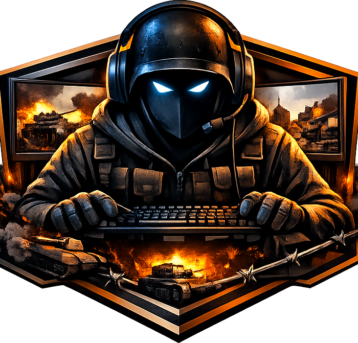
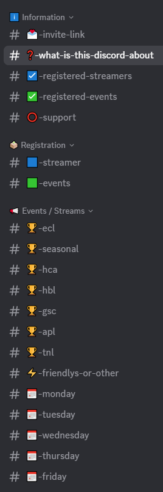

#Hell Let Loose Competitive Event & Stream Hub

  

> A central Discord hub for players who want quick and easy access to live streams and events from the Hell Let Loose competitive scene.

## Overview

The goal of this community project is simple:

To create one central place where Hell Let Loose players can find competitive events and the streamers covering them without having to search across multiple servers, websites, and social media pages.

The Discord is designed as a structured hub for the competitive scene. It gathers registered event listings, registered streamer channels, and automatically posts live stream notifications into clearly categorized channels.

This makes it much easier for anyone interested in competitive Hell Let Loose to discover what is happening, who is streaming it, and where to watch.

---

## Discord Link

https://discord.gg/JApK6tFg6D

---

## Why this project exists

The Hell Let Loose competitive scene is active, but information is often spread across many different places.

Players who enjoy competitive matches usually have to collect information manually:
- find event announcements in one place,
- search for streamers in another,
- check whether someone is live,
- and then figure out where the correct stream link was posted.

This project reduces that friction.

Instead of searching everything manually, the Discord acts as a central access point for competitive event streams.

---

## How it works

### Registered streamers
Streamers can register their channel so it becomes part of the Project.

### Registered events
Events can be submitted if I forget about some.

### Automated live detection
The system checks whether registered streamer channels are live while covering events that are listed in the Discord.

### Categorized live posts
When a relevant live stream is detected, an automatic message with the stream link is posted into the appropriate categorized channel.

That means users do not need to constantly search Twitch, YouTube, Discord posts, or event pages on their own.

---

## Server structure

  

This structure helps users quickly find the type of content they are looking for.
